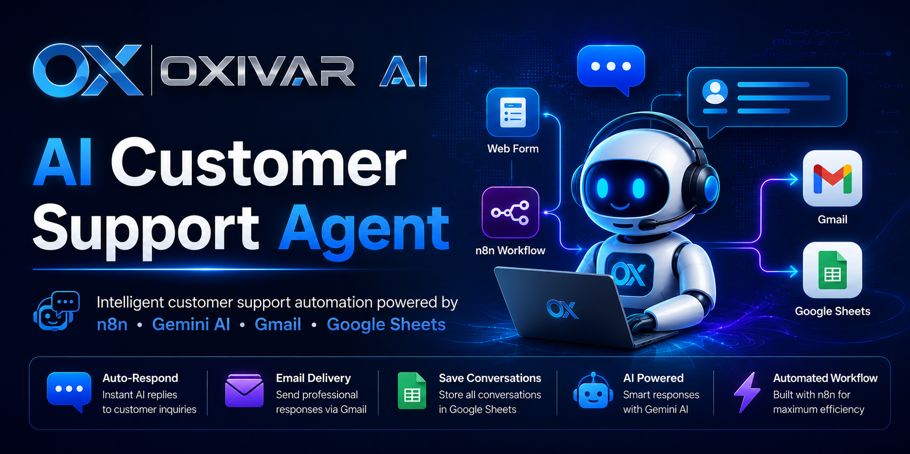

# 🤖 AI Customer Support Agent




---

# 🚀 Overview

An end-to-end AI Customer Support workflow built with **n8n**, **Google Gemini**, **Google Sheets**, and **Gmail**.

The workflow automatically receives customer inquiries through a responsive HTML form, generates intelligent AI responses using Google Gemini, stores every conversation in Google Sheets, and sends professional email replies via Gmail — all without human intervention.

This project demonstrates how modern AI automation can replace repetitive customer support tasks while maintaining professional communication and complete conversation history.

---

# 🏗 Workflow Architecture


---

# ✨ Features

| Feature | Description |
|---------|-------------|
| 🤖 AI Responses | Generate intelligent customer replies using Google Gemini |
| 🌐 HTML Contact Form | Responsive customer support form |
| ⚡ n8n Automation | Complete workflow automation |
| 📊 Google Sheets | Automatically stores every conversation |
| 📧 Gmail Integration | Sends professional HTML email replies |
| 📁 Clean Data Processing | Customer data normalization before AI processing |
| ♻️ Reusable Workflow | Easily adaptable to any business |

---

# 📸 Screenshots

## Customer Support Form


---

## Google Sheets Conversation Log


---

## Automated Email Response


---

# ⚙️ Workflow Overview

The workflow processes every customer request through the following automated pipeline:

```text
Customer Support Form
        │
        ▼
Receive Customer Request (Webhook)
        │
        ▼
Normalize Customer Data
        │
        ▼
Google Gemini AI Assistant
        │
   ┌────┴────────────┐
   ▼                 ▼
Google Sheets      Gmail
Store History    Send Reply
```

---

# 📁 Project Structure

```text
ai-customer-support-agent/
│
├── assets/
│   ├── banner.png
│   ├── logo-horizontal.png
│   └── screenshots/
│       ├── workflow.png
│       ├── form.png
│       ├── google-sheet.png
│       └── email.png
│
├── workflows/
│   └── customer-support-workflow.json
│
├── index.html
├── README.md
├── LICENSE
└── .gitignore
```

---

# 🛠 Tech Stack

- n8n
- Google Gemini
- Gmail API
- Google Sheets API
- HTML5
- CSS3
- JavaScript

---

# 📥 Installation

## Clone the repository

```bash
git clone https://github.com/engmohamadsamer-netizen/ai-customer-support-agent.git
```

---

## Open the project

```bash
cd ai-customer-support-agent
```

---

## Import the Workflow

Import the following file into your n8n instance:

```text
workflows/customer-support-workflow.json
```

---

## Configure Credentials

Reconnect your own credentials inside n8n:

- Google Gemini
- Gmail
- Google Sheets

---

## Update Webhook URL

Open

```text
index.html
```

Replace the Webhook URL with your own n8n Webhook endpoint.

---

## Run

Execute the workflow inside n8n.

Open:

```text
index.html
```

Submit a customer request and watch the workflow execute automatically.

---

# 🗺 Roadmap

## ✅ Version 1.0

- Responsive HTML Customer Form
- Google Gemini AI Integration
- Google Sheets Conversation Storage
- Professional HTML Email Replies
- Complete n8n Automation Workflow

---

## 🚀 Version 1.1

- Ticket ID Generation
- Conversation Status
- Prompt Engineering Improvements

---

## 🚀 Version 2.0

- AI Memory
- Knowledge Base
- Retrieval-Augmented Generation (RAG)
- Automatic Question Classification

---

## 🚀 Version 3.0

- Admin Dashboard
- Analytics
- Customer Management Panel
- Reporting System

---

# 📄 License

This project is licensed under the **MIT License**.

See the **LICENSE** file for more information.

---

# 👨‍💻 Author

**Mohamad Samer**

GitHub Profile

https://github.com/engmohamadsamer-netizen

Project Repository

https://github.com/engmohamadsamer-netizen/ai-customer-support-agent

---

# ⭐ Support

If you found this project useful, please consider giving it a ⭐ on GitHub.

It helps support future improvements and open-source development.

---

Made with ❤️ using **n8n**, **Google Gemini**, and **OXIVAR AI**.
